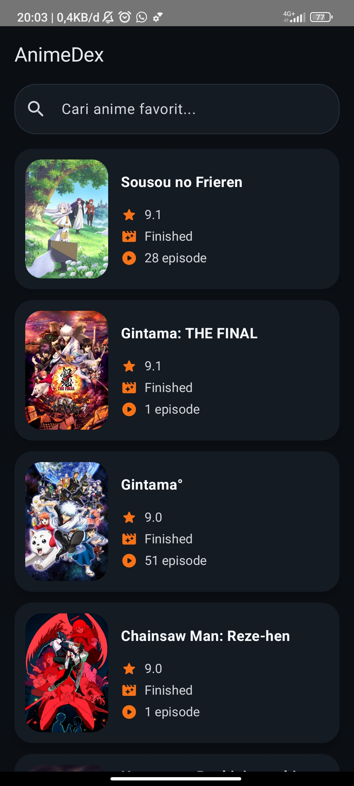
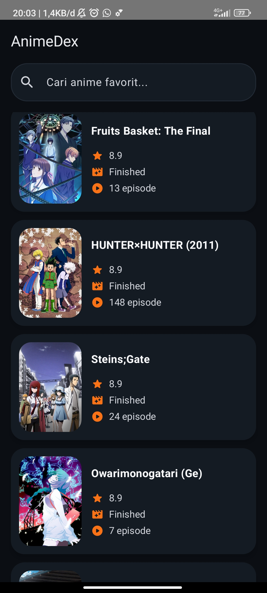
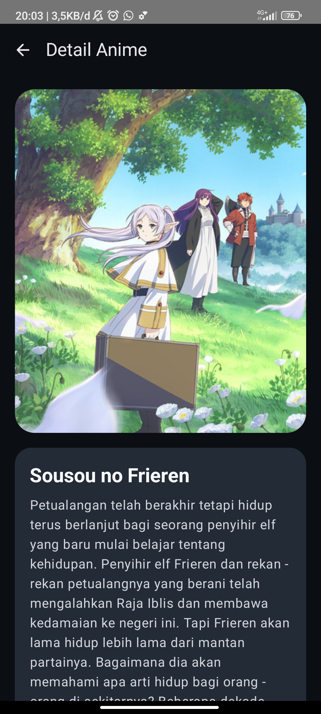
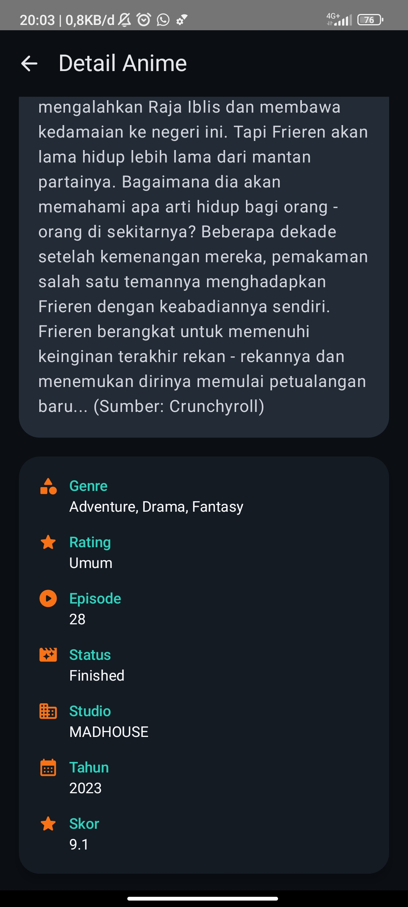

# AnimeDex

**Nama:** Isi Nama Mahasiswa  
**NIM:** Isi NIM Mahasiswa

AnimeDex adalah aplikasi Android native berbasis Kotlin dan Jetpack Compose untuk menampilkan daftar anime dari API publik AniList. Aplikasi memakai arsitektur MVVM, Navigation Compose, StateFlow, Retrofit, Gson Converter, Coil AsyncImage, dan Coroutines.

## Fitur

- Home Screen dengan TopAppBar "AnimeDex", SearchBar, loading, error state, dan daftar anime dalam LazyColumn.
- Card anime berisi poster, judul, skor, status, dan jumlah episode.
- Detail Screen menampilkan poster besar, judul, sinopsis, genre, rating, episode, status, studio, tahun rilis, skor, dan tombol Back.
- Network call dipisahkan ke Repository agar Composable tidak memanggil Retrofit secara langsung.

## Struktur Proyek

```text
app/
  src/main/java/com/example/animedex/
    model/
      AnimeResponse.kt
    network/
      AniListApiService.kt
      RetrofitClient.kt
    repository/
      AnimeRepository.kt
    viewmodel/
      DetailViewModel.kt
      HomeViewModel.kt
      UiState.kt
    ui/
      component/
        AnimeCard.kt
        AnimePoster.kt
        AnimeSearchBar.kt
        StateContent.kt
      screen/
        DetailScreen.kt
        HomeScreen.kt
      theme/
        Color.kt
        Theme.kt
    navigation/
      AnimeDexNavHost.kt
      AnimeRoutes.kt
    MainActivity.kt
```

## Cara Menjalankan

1. Buka folder project ini di Android Studio.
2. Tunggu Gradle Sync selesai.
3. Jalankan aplikasi pada emulator atau perangkat Android.
4. Untuk membuat APK debug, jalankan:

```bash
./gradlew assembleDebug
```

APK debug akan berada di:

```text
app/build/outputs/apk/debug/app-debug.apk
```

## Dependency Utama

- Kotlin
- Jetpack Compose
- Material Design 3
- Navigation Compose
- Lifecycle ViewModel Compose
- StateFlow
- Retrofit
- Gson Converter
- Coil Compose AsyncImage
- Kotlin Coroutines
- MyMemory Translation API untuk menerjemahkan sinopsis ke Bahasa Indonesia

## Screenshot Aplikasi

Geser ke kanan/kiri untuk melihat tampilan Home dan Detail secara ringkas.

| Home 1 | Home 2 | Detail 1 | Detail 2 |
| --- | --- | --- | --- |
|  |  |  |  |

## API yang Digunakan

- Endpoint AniList GraphQL: `https://graphql.anilist.co/`
- Daftar anime: query `Page { media(type: ANIME, search: ..., sort: SCORE_DESC) }`
- Detail anime: query `Media(id: ..., type: ANIME)`
- Translate sinopsis: `https://api.mymemory.translated.net/get`

Request anime tetap dikirim memakai Retrofit dan Gson Converter melalui HTTP `POST` ke endpoint GraphQL AniList. Sinopsis dari AniList diterjemahkan otomatis ke Bahasa Indonesia saat halaman Detail dibuka.
